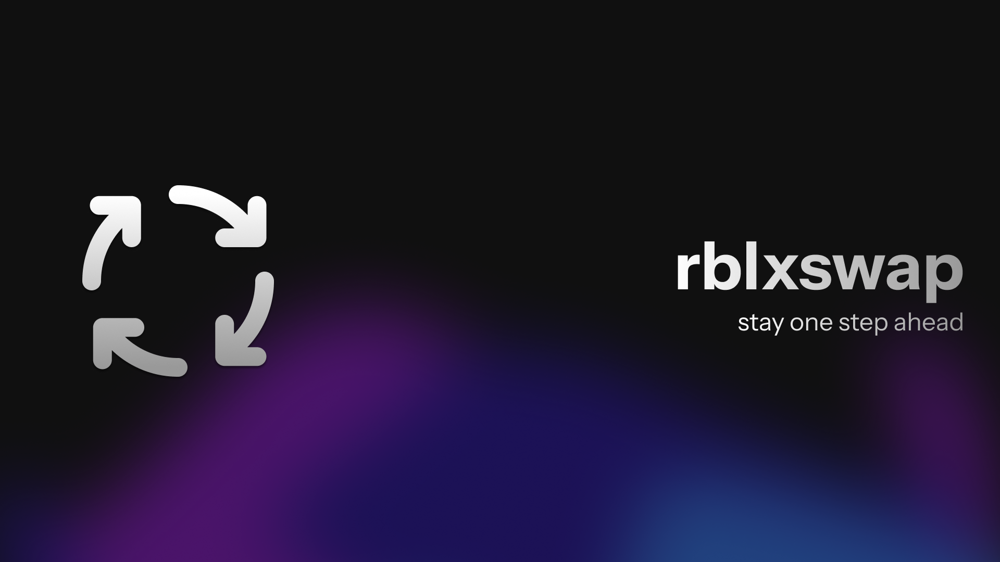

  

---

  a quick utility to bypass Roblox's BanAsync API & alt detection

---

###  how it works

it changes your network adapter(s)'s mac address(es) and clears roblox related cache, logs, prefetch files, etc. to ensure you can get back to playing without being tracked by the  BanAsync api. 

###  usage

1. run the executable as administrator (from release)
2. clean roblox traces
3. optionally spoof mac address (either randomly or by mirroring an existing adapter's OUI)
4. you're good to go WATTTTTTT

---

built with <code>electron</code>  & <code>javascript</code> 
 
if you'd like to build this yourself, check out <a href="BUILDING.md">this</a>

###  credits

huge thanks to [centerepic's ByeBanAsync](https://github.com/centerepic/ByeBanAsync) because without it i would've gotten a few things wrong with mac spoofing 😭♥
